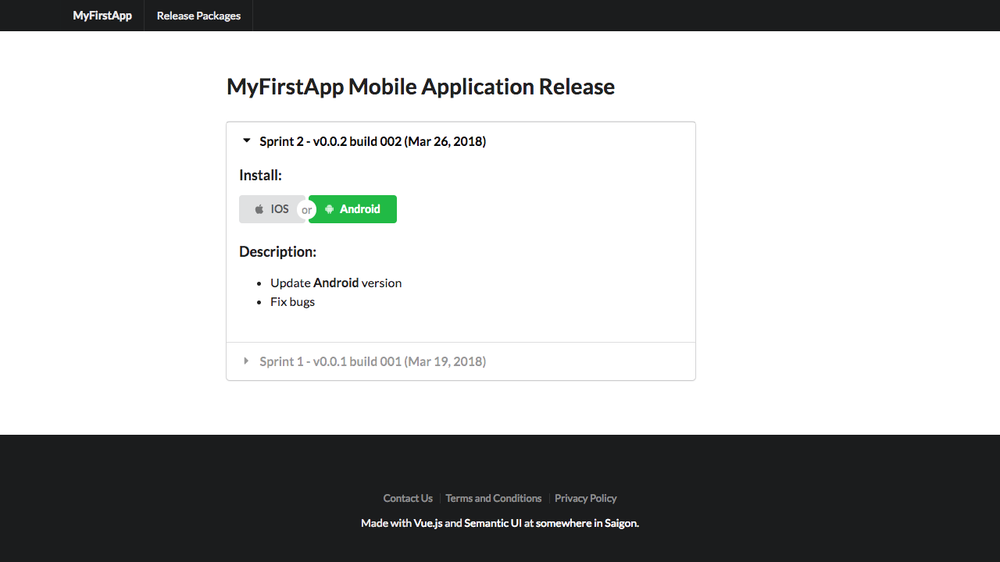

# Simple Layout For Mobile Release Page

A simple project, built with Vue.js and Semantic UI



## Support

 |  |  |  | 
--- | --- | --- | --- | --- |
Latest ✔ | Latest ✔ | 9+ ✔ | Latest ✔ | 8.0+ ✔ |

[**View Demo**](https://lbngoc.github.io/simple-layout-app-release-packages/)

## Build Setup

``` bash
# install dependencies
npm install

# serve with hot reload at localhost:8080
npm run dev

# build for production with minification
npm run build
```

## How It Works

Only require 3 files to work `index.html`, `dist/build.js` and `app.packages.json`

### Settings

To override default settings, open `index.html` and change `window.SETTINGS` if needed

```
window.SETTINGS = {
  appName: 'MyFirstApp', // default: app, required for generate binary installation path
  binDir: 'packages', // default: packages, required for generate binary installation path
  // appData: 'app.packages.json', // default: app.packages.json, required for read data and render
  // getReleaseTitle: function(item) {
  //   return 'Sprint #' + item.sprint;
  // },
  // getBinPath: function(os, item) {
  //   if (os === 'ios') {
  //     return 'ios.ipa';
  //   }
  //   return 'android.apk';
  // }
}
```

### Package List File

Sample `app.packages.json`:

```
[{
    "sprint": 2, // number|string (optional)
    "version": "0.0.2", // number|string (optional)
    "buildNumber": "002", // number|string (optional)
    "date": "Mar 26, 2018", // string
    "android": true, // boolean|string
    "ios": true, // boolean|string
    "description": [
      "- Add [Term of Service](tos.html)",
      "- Add <strong>iOS</strong> version"
    ] // array|string (support both markdown format and html)
  },
  ...
]
```

# License

MIT License

Created by [Ngoc L.](https://ngoclb.com) | contact@ngoclb.com
